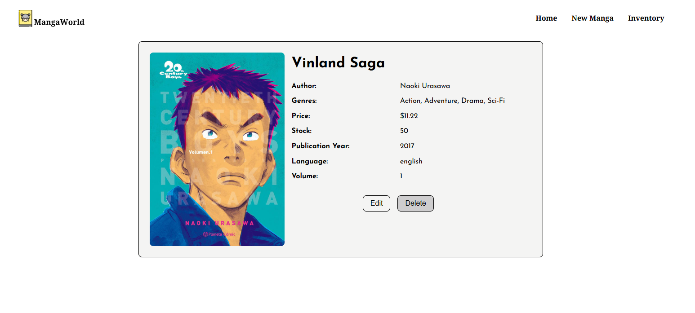

# MangaWorld 📚

[](https://www.typescriptlang.org/)
[](https://react.dev/)

MangaWorld is a full-stack web application designed to manage, explore, and organize manga collections. It provides powerful search capabilities and efficient inventory management through optimized database operations and modern web technologies.

## Features

### Backend

- **REST API** with comprehensive CRUD operations
- Advanced filtering system with database optimization
- Image management using Cloudinary storage
- Data validation with Zod schema system
- PostgreSQL database with:
  - Search vector implementation
  - Many-to-many relationships
  - Performance-optimized indexes
- Automated testing with Jest
- File upload handling with Multer

### Frontend

- Single Page Application (SPA) architecture
- Manga management interface:
  - Create new manga entries
  - Edit existing entries
  - Delete manga records
- Advanced search & filtering by:
  - Title/Name
  - Author
  - Publication Year
  - Language
- Responsive UI with CSS Modules
- Client-side routing with React Router
- Efficient API communication with Axios

## Technologies

### Backend Stack

| Component     | Technology |
| ------------- | ---------- |
| Language      | TypeScript |
| Framework     | Express.js |
| Database      | PostgreSQL |
| Cloud Storage | Cloudinary |
| Validation    | Zod        |
| Testing       | Jest       |
| File Handling | Multer     |

### Frontend Stack

| Component   | Technology   |
| ----------- | ------------ |
| Language    | TypeScript   |
| Framework   | React        |
| Styling     | CSS Modules  |
| Routing     | React Router |
| HTTP Client | Axios        |

## Preview

**Home Page**


**Inventory page**


**Manga View**



**Form Page**


**Mobile View**


## Getting Started

### Prerequisites

- Node.js v18+
- PostgreSQL v14+
- Git
- Cloudinary account (for image storage)

### Installation

1. **Clone Repository**

   ```bash
   git clone https://github.com/yourusername/mangaworld.git
   cd mangaworld
   ```

2. **Install Dependencies**

   ```bash
   # Server dependencies
   cd backend && npm install

   # Client dependencies
   cd frontend && npm install
   ```

3. **Environment Setup**

   - Create `.env` files
   - Update environment variables with your credentials

4. **Run Application**

   ```bash
   # Start backend server
   cd backend && npm run dev

   # Start frontend client (in separate terminal)
   cd frontend && npm run dev
   ```

## API Reference 📡

| Endpoint         | Method | Description            |
| ---------------- | ------ | ---------------------- |
| `/inventory`     | GET    | Get all manga entries  |
| `/inventory/:id` | GET    | Get manga by id        |
| `/inventory`     | POST   | Create new manga entry |
| `/inventory/:id` | PATCH  | Update manga entry     |
| `/inventory/:id` | DELETE | Delete manga by id     |
| `/search`        | GET    | Search manga           |
| `/genre`         | GET    | Manga by genre         |
| `/language`      | GET    | Manga by language      |
| `/year`          | GET    | Manga by year          |
